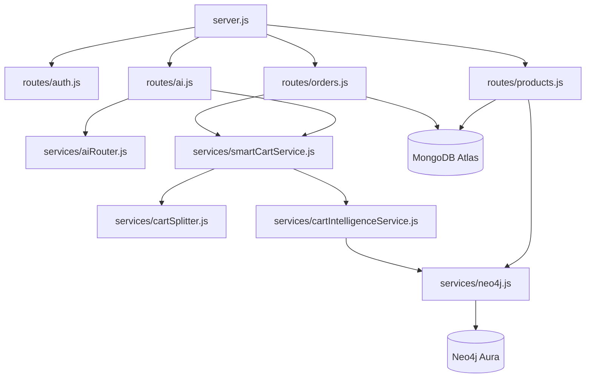

# 01 Project Overview

An architectural drill-down into the modular backend design, package dependencies, and technology matrix.

---

## 1. What is this? (Layman's Explanation)

When we set out to build a modern backend, our primary challenge is organization. Without a structured modular layout, the codebase quickly devolves into spaghetti code where routing, business logic, and database operations are tangled together. This project uses a modular design to keep components separated and maintainable.

Each part of the project has a designated directory. Think of `models/` as the data architect that designs our database schemas, `routes/` as the post office routing requests, and `services/` as the engine room running calculations (like graph-based recommendations and geolocation mapping). Having clear boundaries makes it easier to track down bugs and scale the system over time.

---

## 2. Intuition

Before reviewing the structure, let's look at the patterns in this system:
*   **Modular Subsystems**: Decoupling routing interfaces from business services ensures that changes to our API routes don't break database implementations.
*   **Relational Graph**: Product suggestions are managed by Neo4j, which models relationships between nodes natively. This is much faster than running complex joins on traditional tables.
*   **Data Models**: Mongoose schemas acts as validators, ensuring that data stored in MongoDB remains consistent.

---

## 3. Modular Subsystem Layout

Let's see how our code is structured on disk:

```text
backend/
├── server.js               # Express entrypoint, mounts middleware and socket listeners.
├── config/
│   └── aiModels.js         # Stores parameters (temperature, model keys) for generative models.
├── middleware/
│   └── auth.js             # Parses Authorization header Bearer token and verifies JWT.
├── models/                 # MongoDB schemas mapped via Mongoose.
│   ├── User.js             # User data, geo-coordinates, and biometric hashes.
│   ├── Product.js          # Catalog properties, prices, quantities, and high-dim embeddings.
│   ├── Shop.js             # Seller locations, ratings, and order telemetry stats.
│   ├── Order.js            # Combined transactions, multi-stop trips, and shopGroups.
│   ├── Review.js           # Star-rating documents.
│   └── ProductRatingStat.js# Summaries containing Bayesian prior rating aggregates.
├── routes/                 # Express controllers mapping routing endpoints.
│   ├── auth.js             # Handle auth validation and Face ID.
│   ├── products.js         # Queries, syncing, and scraper pipelines.
│   ├── orders.js           # Splits cart and triggers OSRM.
│   ├── shops.js            # Administer shop coordinates.
│   ├── payments.js         # Mounts payment hooks.
│   ├── ai.js               # Recipes agent and search.
│   ├── reviews.js          # Average aggregations and summaries.
│   ├── admin.js            # Heatmap points generator.
│   └── cart.js             # Validates temporary basket metrics.
├── services/               # State logic layers.
│   ├── neo4j.js            # Bolt driver transactions, index init, and vector matching.
│   ├── aiRouter.js         # Multi-model model switcher and key rotations.
│   ├── smartCartService.js # Closest shops algorithms and delivery computations.
│   ├── cartIntelligence.js # Recommendation matches (SIMILAR_TO, BOUGHT_WITH).
│   ├── cartSplitter.js     # Cart separator.
│   └── userReportService.js# Node-PDF compiler.
└── sockets/
    └── storeboard.js       # WebSocket namespaces for sales updates.
```

---

## 4. Global Component Dependency Graph



---

## 5. Real Project Context

In **SmarterBlinkit**, the backend coordinates database calls across MongoDB and Neo4j. By separating our architecture into distinct modules, we prevent database connections from blocking other operations.

Let's look at how a user request is handled:
*   [server.js](file:///d:/smarter-blinkit/backend/server.js) acts as the entry point, mounting global middlewares (Helmet and CORS) and registering API paths under `/api`.
*   [routes/products.js](file:///d:/smarter-blinkit/backend/routes/products.js) handles catalog lookups. When a new product is scraped, it triggers [services/neo4j.js](file:///d:/smarter-blinkit/backend/services/neo4j.js) to generate and sync its vector embedding.
*   This structure allows us to scale individual components (like adding a caching layer to our products route) without affecting the rest of the application.
