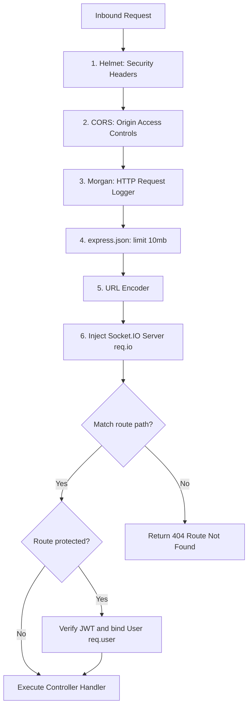

# 02 Request Lifecycle

Detailed execution traces and global middleware hooks.

---

## 1. What is this? (Layman's Explanation)

When a user interacts with our app—like clicking "Search" or placing an order—their browser doesn't communicate directly with our databases. Instead, it sends an HTTP request to our Express server. The Express server acts like a receptionist, receiving the request and verifying its details before passing it to the correct handler.

The request lifecycle is the journey every request takes through our backend. It starts at [server.js](file:///d:/smarter-blinkit/backend/server.js), passes through security and authentication middlewares, triggers business logic calculations, queries the databases, and finally returns a formatted response to the client.

---

## 2. Intuition

Let's look at how requests flow through our system:
*   **Middleware**: Think of middlewares as security checkpoints at an airport. They inspect incoming requests (checking headers and JWT tokens) before letting them proceed.
*   **Routers**: Routers are like signs in a building, directing requests to the correct controller based on the URL path.
*   **Controller**: Controllers act as coordinators, extracting parameters from requests and calling the appropriate services to process them.

---

## 3. Global Middleware Lifecycle



---

## 4. Deep Execution Trace: Order Creation (`POST /api/orders`)

Here is what happens when a user places an order:

1.  **Entry Point**: Express gateway catches HTTP request at [server.js](file:///d:/smarter-blinkit/backend/server.js).
2.  **Middlewares**: Binds headers, validates CORS, parses JSON body payload, and injects Socket.IO connection instance to `req.io`.
3.  **Authentication**: Routes to [middleware/auth.js](file:///d:/smarter-blinkit/backend/middleware/auth.js). Decodes Bearer token, fetches Mongoose User schema, and verifies role:
    *   *Input*: `req.headers.authorization = "Bearer eyJhbG..."`
    *   *Output*: Populates `req.user` with user document (e.g. role: `buyer`).
4.  **Route Dispatch**: Matches `POST /api/orders` in [routes/orders.js](file:///d:/smarter-blinkit/backend/routes/orders.js).
5.  **Local Cart Splitting**:
    *   Finds matching stores with sufficient stock for each item.
    *   Sorts shops by distance to user coordinates using the Haversine formula (implemented in [routes/orders.js](file:///d:/smarter-blinkit/backend/routes/orders.js)'s `getDistance` helper).
    *   Selects closest shop and groups items by shop ID via the [services/cartSplitter.js](file:///d:/smarter-blinkit/backend/services/cartSplitter.js) service.
6.  **OSRM Multi-Stop Route Generation**:
    *   Compiles coordinate strings of matched shops and appends the user's home location as the final destination.
    *   Fetches optimized route from OpenStreetMap OSRM API trip endpoint:
        ```
        https://router.project-osrm.org/trip/v1/driving/[coords]?source=any&destination=last&roundtrip=false
        ```
7.  **Order Persistence**: Creates MongoDB order document via Mongoose, storing optimized trip geometry, totals, and shop groupings.
8.  **Inventory Adjustment**: Updates MongoDB product documents to decrement stock and increment sales counts.
9.  **Neo4j Graph Synchronization**: Triggers `incrementProductSales` and `recordBoughtTogether` in [services/neo4j.js](file:///d:/smarter-blinkit/backend/services/neo4j.js). Creates or increments `BOUGHT_WITH` relationships in Neo4j.
10. **WebSocket Broadcast**: Emits a `newOrder` event containing shopGroups and order totals to the `storeboard` room (handled in [sockets/storeboard.js](file:///d:/smarter-blinkit/backend/sockets/storeboard.js)).
11. **Client Response**: Formats final JSON with populated user name and email, returning a `201 Created` status code.

---

## 5. System Call Graph

```text
POST /api/orders
 └── protect & requireRole('buyer')
      └── router.post()
           ├── Product.find({ _id: { $in: productIds } })
           ├── for (item of items)
           │    └── Product.find({ barcode/name, stock }) -> Find alternatives
           │         └── getDistance(userCoords, shopCoords) -> Haversine calculation
           ├── cartSplitter(enrichedItems) -> Group items by shop ID
           ├── axios.get(OSRM_URL) -> Fetch optimal trip routing geometry
           ├── Order.create(orderPayload) -> Write transaction log
           ├── for (item of enrichedItems)
           │    ├── Product.findByIdAndUpdate(item.productId, { $inc: { stock, salesCount } })
           │    ├── Shop.findByIdAndUpdate(item.shopId, { $inc: { totalOrders } })
           │    └── neo4jService.incrementProductSales(productId, quantity)
           │         └── Cypher: MERGE (p:Product {id}) SET p.salesCount = salesCount + inc
           ├── neo4jService.recordBoughtTogether(productIds, productsMeta)
           │    └── Cypher: MATCH (a), (b) MERGE (a)-[r:BOUGHT_WITH]-(b)
           ├── req.io.emit('newOrder', orderSummary) -> WebSocket broadcast
           └── order.populate('buyerId')
```

### Call Trail Analysis

The call graph above details the execution sequence when a buyer initiates a checkout. Let's trace it step-by-step:
*   First, we run authentication middleware checking if the buyer is registered and validated.
*   Once authorized, the request hits the route controller. The system queries MongoDB for the basic catalog data of the selected items to check their standard properties (prices and names).
*   Next, for each item, the controller queries local stores to check stock and coordinates using the Haversine formula to compute spatial distances in kilometers.
*   The cart splitting algorithm groups items by store ID, calculating separate subtotals.
*   A query is sent to the OSRM REST endpoint to calculate the optimal delivery trip route ending at the buyer's home address coordinates.
*   An Order record is written to MongoDB. In parallel, MongoDB stock quantities are decremented, and the Neo4j graph relationships are updated.
*   Finally, the system broadcasts the new order alert through Socket.IO and returns the structured order details to the client.
