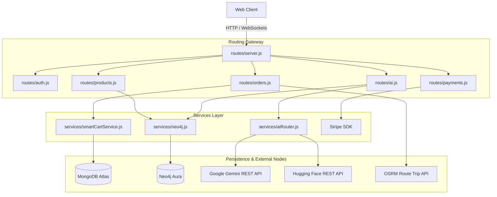

# 21 System Dependency Graph

Visual map of dependencies across systems and databases.

---

## 1. What is this? (Layman's Explanation)

Dependency mapping visualizes connections between different modules in our application, ensuring developers understand how changes to one subsystem affect others.

This document includes a dependency flowchart showing relationships from client-side requests down to database indexes and external integrations.

---

## 2. Intuition

Before reviewing the graph:
*   **Dependency**: When one code module relies on another to function (e.g. controllers requiring database connection drivers).

---

## 3. Complete System Dependency Flow

---

## 4. Dependency Descriptions

*   **routes/auth.js -> middleware/auth.js**: Depends on jwt verify to extract identities.
*   **routes/ai.js -> services/aiRouter.js**: Depends on the router to manage Gemini keys and model fallbacks.
*   **services/cartIntelligenceService.js -> services/neo4j.js**: Depends on the graph driver to execute cypher recommendation queries.
