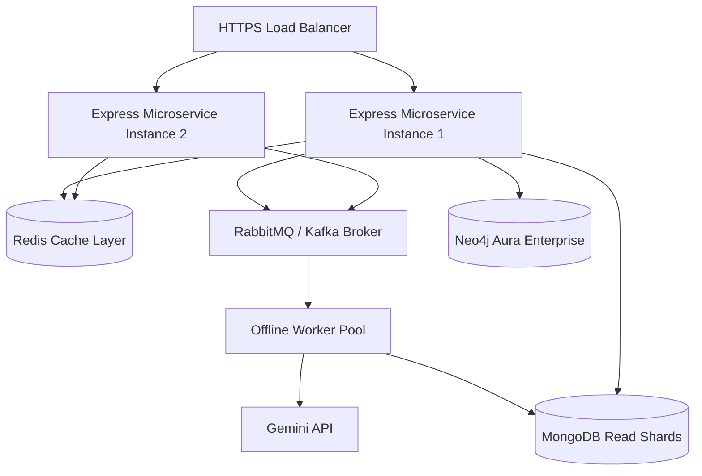

# 23 Future Architecture

Architectural blueprint for scaling the backend system.

---

## 1. What is this? (Layman's Explanation)

As an application grows from thousands to millions of users, its architecture must adapt. A monolithic backend running sequential queries will eventually slow down under high load.

This document designs a future-proof architecture for SmarterBlinkit, introducing caching layers, microservices, and message brokers to handle high concurrent traffic.

---

## 2. Intuition

Let's review the scaling tools:
*   **Load Balancing**: Distributing incoming requests across multiple app servers to prevent single-instance crashes.
*   **Message Queues**: RabbitMQ/Kafka brokers that hold tasks in queues to process them in the background.
*   **Database Sharding**: Splitting database collections across multiple physical servers to balance search loads.

---

## 3. Scale Architecture Map (1 Million Users / 10k Concurrent Requests)

---

## 4. Key Architecture Recommendations

*   **Redis Caching Layer**: Justified. Cache computed OSRM routes, static intent keywords, and product recommendations to reduce database load.
*   **RabbitMQ Message Queue**: Justified. Decouple long-running embedding generations and scraper sync tasks from the main thread.
*   **Dedicated Vector Database**: Not Justified. Neo4j's built-in vector search index is highly performant and keeps data synchronized, removing the need for a separate vector database.
