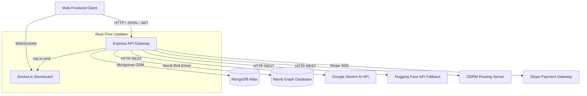

# SmarterBlinkit Backend Architecture Reference & Optimization Audit

Welcome to the **Staff-Level Architecture Reference and Technical Audit** for the SmarterBlinkit backend. This document serves as the single source of truth for understanding, maintaining, optimizing, and scaling this system in production.

---

## 1. What is this? (Layman's Explanation)

When you open a shopping app, search for ingredients, checkout, and pay, a lot of complex tasks happen behind the scenes. In this project, the frontend client (the visual app on your phone or web browser) doesn't talk directly to databases or machine learning models. Instead, it sends HTTP requests to our backend API.

Think of the backend as the central control room of our marketplace. It orchestrates user accounts, matches natural language search queries with the product catalog, tracks items across different stores, calculates delivery routing, handles Stripe payments, and streams live sales metrics to dashboards. It is designed to coordinate multiple databases and third-party services, packaging everything into structured responses that the frontend can understand.

---

## 2. Intuition

Before we dive into the deep technical sections, let's establish some core concepts:
*   **API Gateway / Express**: Think of the Express server as a receptionist. It stands at the entry point of our backend, greeting every incoming request, verifying permissions (JWT), and directing the request to the correct handler.
*   **Databases**: We use a hybrid database structure. MongoDB is like a filing cabinet containing user profiles, stores, and products. Neo4j is like a map on a whiteboard, drawing lines between products to represent recommendations ("purchased together" or "similar characteristics").
*   **AI Models**: Google Gemini is like a smart assistant that parses natural language and converts descriptions (e.g. "I have a cold") into vector embeddings. Vector embeddings are lists of numbers representing semantic meaning, allowing us to perform vector searches to find relevant products.

---

## 3. Production-Scale System Architecture

Here is how the components in our system interact:

---

## 4. Navigation Index

### 🗺️ System Foundations & Lifecycle
*   **[01-project-overview.md](file:///d:/smarter-blinkit/backend-documentation/01-project-overview.md)**: System design, tech stack modules, and dependency trees.
*   **[02-request-lifecycle.md](file:///d:/smarter-blinkit/backend-documentation/02-request-lifecycle.md)**: Complete request-response pipeline tracing, middlewares, and exception guards.
*   **[03-api-architecture.md](file:///d:/smarter-blinkit/backend-documentation/03-api-architecture.md)**: Endpoint schema, parameters validation, and HTTP response codes matrix.

### 🧠 AI & Recommendation Subsystems
*   **[04-ai-intent-engine.md](file:///d:/smarter-blinkit/backend-documentation/04-ai-intent-engine.md)**: LLM recipe parsing, multi-model fallback chain, and catalog resolution.
*   **[05-intent-search.md](file:///d:/smarter-blinkit/backend-documentation/05-intent-search.md)**: Intent parsing and keyword queries expansion, Neo4j vector cosine index lookups, confidence scoring, and multi-tier sorting rules.
*   **[06-recommendation-engine.md](file:///d:/smarter-blinkit/backend-documentation/06-recommendation-engine.md)**: Graph matching Cypher queries, Jaccard/Cosine formulas, and relationship weights.

### 🔍 Product & Geo-Routing Systems
*   **[07-search-ranking.md](file:///d:/smarter-blinkit/backend-documentation/07-search-ranking.md)**: Geospatial ($geoNear) proximity ranking and exact keyword matching.
*   **[08-heatmap-system.md](file:///d:/smarter-blinkit/backend-documentation/08-heatmap-system.md)**: Geo-sales density aggregations and log-intensity calculation.
*   **[09-product-data-flow.md](file:///d:/smarter-blinkit/backend-documentation/09-product-data-flow.md)**: Web scraping pipelines, product synchronization, and embedding indexing.

### 💾 Data & Operations
*   **[10-database-design.md](file:///d:/smarter-blinkit/backend-documentation/10-database-design.md)**: MongoDB / Neo4j index settings, constraints, and aggregation rules.
*   **[11-vector-or-text-search.md](file:///d:/smarter-blinkit/backend-documentation/11-vector-or-text-search.md)**: In-depth comparison, latency analysis, and search pipeline tradeoffs.
*   **[12-external-apis.md](file:///d:/smarter-blinkit/backend-documentation/12-external-apis.md)**: Stripe SDK, Gemini REST, Hugging Face, and OSRM integration payload schemas.
*   **[13-data-models.md](file:///d:/smarter-blinkit/backend-documentation/13-data-models.md)**: Mongoose schemas validation rules and Neo4j node structures.

### ⚙️ Performance & System Audits
*   **[14-caching.md](file:///d:/smarter-blinkit/backend-documentation/14-caching.md)**: Caching profiles, in-memory constraints, and index strategies.
*   **[15-error-handling.md](file:///d:/smarter-blinkit/backend-documentation/15-error-handling.md)**: Global uncaught limits, fallbacks, and Stripe mock recovery.
*   **[16-performance.md](file:///d:/smarter-blinkit/backend-documentation/16-performance.md)**: Time/space complexity bottlenecks and memory alloc checks.
*   **[17-environment-config.md](file:///d:/smarter-blinkit/backend-documentation/17-environment-config.md)**: Config variable registry and deployment thresholds.
*   **[18-deployment.md](file:///d:/smarter-blinkit/backend-documentation/18-deployment.md)**: Ecosystem configurations, seeder logic, and process managers.

### 🛠️ Production Readiness & Auditing
*   **[19-backend-improvement-roadmap.md](file:///d:/smarter-blinkit/backend-documentation/19-backend-improvement-roadmap.md)**: Comprehensive list of architectural bottlenecks categorized by priority and difficulty.
*   **[20-latency-analysis.md](file:///d:/smarter-blinkit/backend-documentation/20-latency-analysis.md)**: Analytical trace of latency contributors for each critical API endpoint.
*   **[21-system-dependency-graph.md](file:///d:/smarter-blinkit/backend-documentation/21-system-dependency-graph.md)**: Visual mapping of frontend routing down to physical databases and external REST backends.
*   **[22-production-readiness-review.md](file:///d:/smarter-blinkit/backend-documentation/22-production-readiness-review.md)**: Scorecard evaluation of security, logs, observability, rate limiting, and failover capabilities.
*   **[23-future-architecture.md](file:///d:/smarter-blinkit/backend-documentation/23-future-architecture.md)**: Blueprint for scale (microservices, Kafka, Redis, vectorDB) with justifications.
